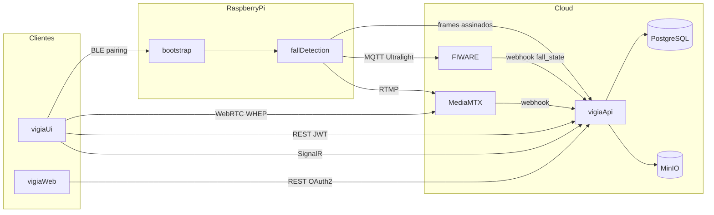

# Estrutura do Projeto VIGIA

## 1. Visão Geral

O VIGIA é um sistema doméstico de monitoramento de quedas que combina dispositivos embarcados (Raspberry Pi 5) com serviços cloud. Na borda, o bootstrap gerencia pareamento BLE, Wi-Fi e identidade do device; o fall-detection captura vídeo, executa inferência YOLO e publica telemetria. Na cloud, a API .NET gerencia usuários, devices, alertas, OTA e integração FIWARE; a stack inclui Orion, IoT Agent, MQTT, PostgreSQL, Redis, MinIO e MediaMTX para streaming. Clientes consomem via app Flutter (Android/iOS) e web Angular. Domínios de produção: API/serviços `services.vigiadeteccoes.com.br`; interface web `vigiadeteccoes.com.br`.

---

## 2. Stack Tecnológica

### Edge

- **Hardware:** Raspberry Pi 5 (8 GB RAM), Raspberry Pi OS Lite 64-bit
- **Runtime:** Python 3.12, asyncio (bootstrap), multiprocessing (fall-detection)
- **ML / Visão:** Ultralytics YOLO (pose), OpenCV, ONNX Runtime (classificador GRU)
- **Comunicação:** BLE (`bless`), MQTT Ultralight (`paho-mqtt`), RTMP para MediaMTX
- **Periféricos:** LCD 16x2 (RPLCD), GPIO (gpiozero/lgpio), Wi-Fi via NetworkManager
- **Persistência local:** SQLite (fall-detection), JSON (`identity.json`, `network.json`, `classifier.json`)
- **Deploy:** PyInstaller ARM64, systemd

### Cloud / Infra

- **Orquestração:** Docker, docker-compose (local e deploy)
- **Proxy / TLS:** Traefik v3.6
- **Banco relacional:** PostgreSQL 15
- **Cache:** Redis
- **Object storage:** MinIO (buckets `vigia-pictures`, `vigia-versions`, `vigia-releases`)
- **FIWARE:** Orion 3.11, IoT Agent Ultralight, Mosquitto, STH-Comet, MongoDB (histórico + interno)
- **Streaming:** MediaMTX (RTMP, WebRTC/WHEP, webhooks)
- **Observabilidade local:** RedisInsight, Portainer (deploy prod)

### Backend

- **Runtime:** .NET 10, ASP.NET Core
- **ORM:** Entity Framework Core + Npgsql (PostgreSQL)
- **Cache:** Redis + in-memory (`Vigia.Cache`)
- **Realtime:** SignalR
- **Auth:** JWT Bearer, Ed25519 (NSec), tokens efêmeros, service token (dev)
- **Push:** Firebase Admin (Android + Web)
- **Docs API:** Swagger/OpenAPI
- **Storage:** S3-compatible via `Vigia.Cloud` (MinIO)

### Mobile

- **Framework:** Flutter / Dart 3.12+
- **Estado:** Riverpod + code generation
- **Navegação:** go_router
- **HTTP:** dio
- **BLE:** flutter_blue_plus
- **Streaming:** flutter_webrtc (WHEP)
- **Realtime:** signalr_netcore
- **Push:** Firebase Cloud Messaging (Android only)
- **i18n:** pt, en, es

### Web

- **Framework:** Angular 22
- **UI:** Optimus UI 2 (fork comunitário MIT do PrimeNG) + Tailwind CSS 4
- **Tipografia:** Plus Jakarta Sans (Google Fonts, SIL OFL)
- **Auth:** JWT email/senha (`POST /auth/login|register|refresh|logout`), alinhado ao app Flutter
- **i18n:** ngx-translate (pt-BR, en-US, es-ES)
- **Testes:** Vitest (`@angular/build:unit-test`)
- **Package manager:** pnpm
- **Push:** Firebase Cloud Messaging (Web + Android; iOS sem push)
- **Status:** shell autenticado com login/cadastro JWT, listagem de devices, detalhes com stream WHEP, edição, sharing, SignalR e sino de notificações FCM; prod em Cloudflare Pages (`vigiadeteccoes.com.br`)
- **Deploy prod:** Cloudflare Pages (estático); local via Docker/nginx no Traefik `:81`

### CI/CD

- **Plataforma:** GitHub Actions
- **CI:** PRs para `develop`/`master` — quality gate por projeto (bandit, pytest, dotnet test, flutter analyze/test, Angular pnpm lint/test/build, gitleaks)
- **Releases:** manuais (`workflow_dispatch`) com tags rolling mutáveis: `service`, `web`, `bootstrap`, `onboard`, `mobile`

---

## 3. Árvore de Diretórios (Alto Nível)

```
vigia/
├── vigia-api/              # API cloud .NET + bibliotecas compartilhadas
├── vigia-bootstrap/        # Control plane Pi: BLE, Wi-Fi, LCD, OTA, identidade
├── vigia-fall/             # Detecção de quedas: câmera, YOLO, MQTT, upload de frames
├── vigia_ui/               # App mobile Flutter (Android/iOS)
├── vigia-web/              # Frontend web Angular (camadas core/pages/shared)
├── docker-compose/         # Stacks local (dev) e deploy (prod), Dockerfiles
├── .github/workflows/      # CI/CD e pipelines de release
├── seed-codes/             # Utilitários dev: frame assinado + seed do edge local
├── edge-data/              # Mock local identity/network/classifier (gerado; gitignored)
├── docs/                   # Documentação viva do projeto (este arquivo)
├── README.md               # Guia operacional Pi + FIWARE (referência detalhada)
├── .cursor/rules/          # Regras Cursor (project-documentation.mdc)
└── .vscode/                # Launch configs (API, UI, Bootstrap, Fall) e tasks do workspace
```

---

## 4. Serviços e Módulos Principais

### vigia-api

**Propósito:** API REST central — autenticação, gestão de devices/usuários/grupos, integração FIWARE, alertas, OTA, upload de frames, push notifications, SignalR.

**Tecnologias:** .NET 10, ASP.NET Core, EF Core, Redis, SignalR, Firebase Admin, NSec.

**Ponto de entrada:** `vigia-api/Vigia.API/Program.cs` — base path `/vigia`, porta local `8090` (Docker: `8090:8080`).

**Bibliotecas (`vigia-api/Libraries/`):**

| Projeto | Responsabilidade |
|---------|------------------|
| `Vigia.Models` | Entidades, enums, DTOs, middlewares de auth, helpers, exceções |
| `Vigia.Database` | EF Core, DAOs, migrations, configurações de entidade |
| `Vigia.Fiware` | Cliente HTTP Orion/IoT Agent, sync de schema, subscriptions |
| `Vigia.Cache` | Abstrações Redis + in-memory |
| `Vigia.Cloud` | Storage S3-compatible (versões OTA + pictures) |

**Controllers:**

| Controller | Responsabilidade |
|------------|------------------|
| `AuthController` | Login, refresh token, logout |
| `UserController` | Push tokens do usuário |
| `DevicesController` | CRUD e registro de devices |
| `DevicesCommandController` | Comandos FIWARE para devices |
| `DevicesFrameController` | Upload e acesso a frames (assinatura Ed25519) |
| `DeviceShareController` | Convites e compartilhamento de grupos |
| `DevicesUsersController` | Membros do grupo / associação user-device |
| `DeviceUpdatesController` | OTA — upload e distribuição de versões |
| `AlertController` | Webhook de alertas FIWARE (queda) |
| `InviteRedirectController` | Redirect público de convites |
| `HealthCheckController` | Health check |

**Hub SignalR:** `DeviceGroupsHub` em `/vigia/hubs/device-groups`

**Configuração:** `vigia-api/Vigia.API/appsettings.json`, `appsettings.Development.json` — sobrescritas por env vars (`__` separator); `Streaming:IngestUrl` é enviado ao edge durante o pareamento. Nunca commitar segredos.

**Testes:** `vigia-api/Tests/` — Unit (API, Models, Database, Fiware, Cache) + Integration (scaffold, majoritariamente placeholders).

---

### vigia-bootstrap

**Propósito:** Control plane do Raspberry Pi — pareamento BLE com app mobile, provisionamento Wi-Fi, LCD/GPIO, identidade do device, OTA do bootstrap.

**Tecnologias:** Python 3.12, asyncio, bless (BLE), gpiozero/lgpio, RPLCD, PyInstaller.

**Ponto de entrada:** `vigia-bootstrap/main.py`

**Módulos principais:**

| Módulo | Path | Função |
|--------|------|--------|
| `provision/` | `vigia-bootstrap/provision/` | BLE, Wi-Fi, identidade, classificador, OTA, estado |
| `ui/` | `vigia-bootstrap/ui/` | LCD 16x2, menu, GPIO buttons |
| `deploy/` | `vigia-bootstrap/deploy/` | Scripts install/uninstall, systemd unit |

**Deploy:** `/opt/vigia/bootstrap/`, systemd `vigia-bootstrap.service`

**Outputs:** `/opt/vigia/identity.json`, `/opt/vigia/network.json` (obrigatórios para fall-detection); `/opt/vigia/classifier.json` (preferência de modelo; default `math`). Em debug local: `{DATA_DIR}/` (ex.: `./data`).

**Paths de instalação vs debug:** `DATA_DIR` define identity/network; OTA usa `VIGIA_OTA_DIR` ou, se `DATA_DIR≠/opt/vigia`, `{DATA_DIR}/ota` (na placa: `/var/lib/vigia/ota`); install root = `VIGIA_INSTALL_ROOT` ou `DATA_DIR`.

**Build:** `make build-linux-arm64` → `dist/vigia-bootstrap-deploy.zip`

**Docs operacionais:** `vigia-bootstrap/docs/DEPLOY.md`

---

### vigia-fall

**Propósito:** Serviço de detecção de quedas — captura de câmera, inferência YOLO pose, detecção de queda, telemetria FIWARE via MQTT, upload de frames assinados, streaming RTMP.

**Tecnologias:** Python 3.12, Ultralytics YOLO, OpenCV, onnxruntime, paho-mqtt, SQLite, PyInstaller.

**Ponto de entrada:** `vigia-fall/main.py` — multiprocess (capture + FIWARE + streaming sob demanda)

**Módulos principais:**

| Módulo | Path | Função |
|--------|------|--------|
| `capture/` | `vigia-fall/capture/` | Câmera full-rate, YOLO subsampled (`FRAME_RATE`) com backpressure, `CaptureFrameArchive` no ritmo de classificação, upload; SHM streaming + `EventShmRing` fall_state/logs |
| `capture/classifiers/` | `vigia-fall/capture/classifiers/` | Miolo pluggável `math` \| `gru` (`FallClassifier`) |
| `streaming/` | `vigia-fall/streaming/` | Processo RTMP sob demanda (`run_stream`); `frame_shm` + publish direto FFmpeg; `mp_compat` spawn |
| `integration/` | `vigia-fall/integration/` | Processo FIWARE com MQTT persistente (cmds + attrs); `fall_shm` (`EventShmRing`) |
| `connection/` | `vigia-fall/connection/` | Conectividade e runners auxiliares |
| `database/` | `vigia-fall/database/` | SQLite local |
| `shared/` | `vigia-fall/shared/` | Comandos FIWARE, helpers, config, `classifier.json`, `log_config`, `event_shm`, `log_bridge` |

**IPC fall_state e logs:** `EventShmRing` (shared memory, multi-slot, drop-oldest) — captura escreve fall_state e logs de decisão sem I/O; FIWARE faz poll (50 ms) e publica MQTT; supervisor drena logs via `LogDrainThread` (~1 ms) para stdout único (`log_shm` 128 slots).

**Logging:** `shared/log_config.configure_logging` com flush imediato; decisões via `log_bridge.emit_log` → SHM → drain no `main`; logger `vigia.decision`. **`STATE_LOG_MODE`:** `verbose` (prototipação — toda decisão, warm-up, no_person), `changes` (só transições), `heartbeat` (+ ping a cada `STATE_LOG_INTERVAL_S`). Defaults dev: `LOG_LEVEL=DEBUG`, `STATE_LOG_MODE=verbose`. Fallback standalone (`python -m capture`) escreve direto em `vigia.decision`. Filtro: `journalctl -u fall-detection -f | grep vigia.decision`.

**Deploy:** `/opt/vigia/fall-detection/`, systemd `fall-detection.service`

**Pré-requisito:** bootstrap concluído (`identity.json` + `network.json`, incluindo `stream_ingest_url`); `classifier.json` opcional (default `math`)

**Build:** `make build-linux-arm64` → `dist/vigia-fall-detection-deploy.zip` + tarball OTA (inclui `model/gru_2classes.onnx`)

**Docs operacionais:** `vigia-fall/docs/DEPLOY.md`

---

### vigia_ui

**Propósito:** App mobile para usuários finais — auth, pareamento BLE, live stream (WebRTC/WHEP), gestão de devices, compartilhamento, push notifications.

**Tecnologias:** Flutter, Riverpod, go_router, dio, flutter_blue_plus, permission_handler, device_info_plus, flutter_webrtc, signalr_netcore, Firebase (Android only).

**Ponto de entrada:** `vigia_ui/lib/main.dart`

**Arquitetura de pastas:**

| Pasta | Responsabilidade |
|-------|------------------|
| `lib/core/` | Router, providers base, config |
| `lib/domain/` | DTOs, enums, models de UI |
| `lib/data/` | Services, repositories, API client |
| `lib/presentation/` | Pages, widgets, providers de UI |
| `packages/firebase_*_android/` | Overrides path de `firebase_core` / `firebase_messaging` sem plataforma iOS (evita firebase-ios-sdk no SPM) |
| `packages/wifi_scan/` | Fork local com Swift Package Manager |

**Env:** `homolog.env` (debug), `production.env` (release) — `API_URL`, `STREAM_BASE_URL`; a URL de publicação RTMP é recebida da API durante o pareamento BLE

**iOS (device físico / LAN):** `Info.plist` declara `NSLocalNetworkUsageDescription` + `NSAllowsLocalNetworking` para HTTP ao IP local do Mac (ex.: `10.x`). Sem “Rede Local” permitido em Ajustes, o app não alcança a API e nenhum request aparece nos logs.

**Plataformas:** Android + iOS (push/FCM apenas Android; plugins Firebase não entram no build iOS)

---

### vigia-web

**Propósito:** Frontend web Angular — autenticação JWT (login/cadastro), shell autenticado (layout), listagem e detalhes de devices (stream WHEP, edição, usuários/compartilhamento), página home. Camadas `core` / `pages` / `shared` com path aliases.

**Tecnologias:** Angular 22, Optimus UI 2 (MIT, Community do PrimeNG), Tailwind 4, Plus Jakarta Sans (Google Fonts), ngx-translate, Vitest, pnpm.

**Ponto de entrada:** `vigia-web/src/main.ts` → `AppComponent` + `appConfig` (`src/app/app.config.ts`).

**Aliases TypeScript** (`vigia-web/tsconfig.json`): `@core`, `@pages`, `@shared`, `@environments`.

**Arquitetura de pastas:**

| Pasta | Responsabilidade |
|-------|------------------|
| `src/app/core/` | Guards, interceptors (`ApiBaseUrl`, JWT auth+refresh), entities/DTOs, mappers, services HTTP/sessão, usecases |
| `src/app/pages/` | Rotas/features: auth unificada (`/login`), layout, devices, home, `main.routes.ts` |
| `src/app/shared/` | Componentes reutilizáveis (input, message, device-card, toolbar superior), preset de tema Optimus UI (`vigia.theme.ts`) |
| `src/environments/` | `environment.ts` (local `localhost:81`) / `environment.prod.ts` (`services.vigiadeteccoes.com.br`) — `apiUrl`, `streamBaseUrl` absolutos + idiomas |
| `public/i18n/` | Traduções JSON (pt-BR, en-US, es-ES) |
| `public/_redirects` | SPA fallback Cloudflare Pages (`/invite/*`, `/*` → `/index.html` 200) |

**Rotas:** `/login` (`guestGuard`, tela unificada login/cadastro estilo Flutter); `/register` → redirect `/login?mode=register`; `/invite/:token` (aceitar convite de compartilhamento; `inviteEntryGuard` persiste token e redireciona anônimos ao login); `/` → layout + `authGuard` → `/devices` (default); `/devices/:deviceId` (detalhe + stream); `/devices/:deviceId/clips` (stub); `/home` (idioma). Shell: toolbar full-bleed (logo + avatar/logout). Tema claro only (como Flutter). Sem cadastro BLE de devices na web.

**Status:** login/cadastro JWT unificado (UI alinhada ao Flutter) e sessão local; listagem de devices; detalhe com live stream WHEP (`streamBaseUrl` + `START_STREAMING`), edição owner, usuários/compartilhamento (gerar link + aceitar convite via `/invite/:token`), SignalR `device-groups`; push FCM web (sino + histórico local); clips stub.

---

### seed-codes

**Propósito:** Utilitários de desenvolvimento — frame assinado e mock do edge local (sem Pi/BLE).

| Script | Função |
|--------|--------|
| `seed-codes/publish_frame.py` | POST de JPEG de teste em `/devices/{id}/frame` (Ed25519 / TestDeviceSeed) |
| `seed-codes/seed_local_edge.py` | Gera `identity.json` + `network.json` + `classifier.json` em `edge-data/` alinhados ao device DEBUG da API |

**Edge mock local:** `edge-data/` (gitignored exceto README). Bootstrap/fall usam `DATA_DIR=../edge-data`. Device: `Vigia-a1b2c3d4` / admin group. Login app: `admin` / `admin123`.

---

### docker-compose

**Propósito:** Orquestração de infra local (dev) e deploy (prod).

| Path | Uso |
|------|-----|
| `docker-compose/local/docker-compose.yaml` | Stack completa de desenvolvimento (API, web SPA, Postgres, Redis, MinIO, Traefik, FIWARE, MediaMTX) |
| `docker-compose/local/default.env` | Variáveis de ambiente da API em dev |
| `docker-compose/deploy/docker-compose.yaml` | Deploy mínimo — `vigia-api` com Traefik TLS (web em Cloudflare Pages) |
| `docker-compose/deploy/infra.sh` | Deploy completo via `docker run` individual (prod) |
| `docker-compose/deploy/infrastructure-compose.yaml` | Compose alternativo com stack completa + Portainer |
| `docker-compose/deploy/.env.example` | Template de env de produção |
| `docker-compose/dockerfiles/` | Dockerfiles (`vigia-api.dockerfile`, `vigia-web.dockerfile` + nginx SPA local, `mediamtx.dockerfile`) |

**Rede Docker:** `vigia-network` (externa no deploy)

**FIWARE local (dev):** proxy Traefik na porta `81` → `http://host.docker.internal:81/vigia/fiware/`. Routers Traefik aceitam Host `localhost`, `127.0.0.1`, `host.docker.internal` e IPs. A API local é buildada em **Debug** para seed do device de teste + `EnsureSeedDeviceAsync`. Web SPA local em `http://localhost:81/` (priority Traefik baixa); API em `/vigia`, stream em `/live`.

---

### CI/CD (`.github/workflows/`)

| Workflow | Gatilho | Artefato / Ação |
|----------|---------|-----------------|
| `continuos-integration.yml` | PR → `develop`/`master` | Quality gate por projeto (Python, .NET, Flutter, Angular), gitleaks, AI attribution check |
| `service-release.yml` | Manual | Build Docker → Docker Hub `pedroreis16/vigia-api:latest` → deploy Portainer → tag rolling `service` |
| `web-release.yml` | Manual | Build Angular → Cloudflare Pages (`vigia-web` / `vigiadeteccoes.com.br`) → tag rolling `web` |
| `bootstrap-pipeline.yml` | Manual | Test amd64 → build ARM64 → `vigia-bootstrap-deploy.zip` → tag rolling `bootstrap` |
| `onboard-release.yml` | Manual | Build ARM64 → deploy zip + OTA tarball → tag rolling `onboard`; upload opcional para API |
| `mobile-release.yml` | Manual | Preflight → security → quality → tests → APK assinado → tag rolling `mobile` |
| `validate-project.yml` | Reusable (`workflow_call`) | Validação SemVer de tags para projetos `onboard`/`api` |

**Scripts auxiliares:** `.github/scripts/install-liblgpio.sh`, `hydrate-firebase-options.sh`

---

## 5. Decisões Arquiteturais

1. **Schema FIWARE em appsettings como fonte da verdade** — Atributos e comandos definidos em `Fiware:Devices`; sincronizados automaticamente no startup via `FiwareServiceJob`. Evita drift entre API e IoT Agent.

2. **Provisionamento FIWARE antes do banco** — No registro de device, FIWARE é provisionado primeiro; se a persistência no PostgreSQL falhar, o provisionamento é revertido (`DevicesService.RegisterDeviceAsync`).

3. **Ordem de instalação edge** — bootstrap → pareamento via app → fall-detection. O fall só inicia com `identity.json` e `network.json` presentes.

4. **Autenticação multi-esquema** — JWT Bearer para usuários mobile/web; Ed25519 para requests de devices (frames); tokens efêmeros para acesso a frames; token de serviço para dev (`AllowAnonymous` handler, IP privado); token MediaMTX para webhooks de streaming.

5. **Tags rolling no CI** — Tags `service`, `web`, `bootstrap`, `onboard`, `mobile` são sobrescritas a cada release. Sem SemVer no GitHub para esses artefatos; simplifica deploy operacional.

6. **Deploy cloud separado por camada** — API/infra em compose mínimo EC2 + Traefik (`services.…`); web estático em Cloudflare Pages (`vigiadeteccoes.com.br`). Local: SPA no Traefik `:81` via container nginx.

7. **Migrations automáticas no startup** — `MigrationStartupFilter` aplica EF migrations ao iniciar. Em DEBUG, seeda device de teste via `TestDeviceSeed`.

8. **Push notifications Android-only** — Firebase/FCM só no Android: `dependency_overrides` apontam para `packages/firebase_*_android` (sem plataforma iOS), bootstrap/coordenador com guard `Platform.isAndroid`; iOS não liga firebase-ios-sdk.
8. **Push notifications** — Firebase/FCM para Android e Web (`platform: web`); iOS sem push por enquanto. Web: service worker `firebase-messaging-sw.js`, token via `PUT /users/push-token`, inbox local no sino da toolbar.

9. **Ultralight + MQTT** — Comandos entregues via MQTT, não poll. Collection `commands` vazia no MongoDB do IoT Agent é comportamento esperado.

10. **Base path `/vigia`** — Toda a API, hubs SignalR e endpoints FIWARE proxy ficam sob `/vigia` via Traefik e `BasePath` config.

11. **Soft-delete** — Entidades estendem `BaseEntity` com `DeletedAt`; registros não são removidos fisicamente.

12. **Compartilhamento via grupos** — Devices pertencem a grupos; owner gerencia convites; limite de membros imposto na API.

13. **UI web com PrimeNG Community (MIT)** — `primeng` 22+ é comercial (PrimeUI) e exige chave de licença. O vigia-web usa `@openng/optimus-ui` v2, fork comunitário MIT do último PrimeNG open-source, com tema Aura customizado em `src/app/shared/theme/vigia.theme.ts` (primary `#669CEE`, light-only como Flutter `ThemeMode.light`; `darkModeSelector: false`).

---

## 6. Regras de Negócio

| Regra | Onde é aplicada |
|-------|-----------------|
| Nome do device deve seguir `^Vigia-[0-9a-f]{8}$` (ex.: `Vigia-a1b2c3d4`) | `DevicesService`, `vigia-bootstrap/provision/identity.py`, `vigia_ui/lib/domain/constants.dart` |
| Classificador de queda: `math` (padrão) ou `gru`; persistido em `classifier.json`; seleção via LCD (guia Modelo); fall lê no start e instancia `FallClassifier`; unlink/clear Wi-Fi não apagam o ficheiro | `vigia-bootstrap/provision/classifier.py`, `ui/menu.py`; `vigia-fall/capture/classifiers/` |
| Chave pública Ed25519 (hex 64 chars) obrigatória no registro | `DevicesService` + `DeviceSignatureAuthenticationHandler` |
| Registro duplicado é idempotente (request ignorada) | `DevicesService.RegisterDeviceAsync` |
| Máximo **10 usuários por grupo** | `DeviceShareService.MaxGroupUsers` |
| Convite expira em **7 dias**; apenas o owner pode gerar | `DeviceShareService` |
| JWT access token: **10 min**; refresh token: **7 dias** com rotação e revogação | `appsettings.json` (JWT) + `AuthService` |
| Alerta de queda: subscription Orion `fall_state==fall` → webhook API → push Firebase ao grupo | `appsettings.json` (`Fiware:Subscriptions`) + `AlertService` |
| Comandos FIWARE: `stream_on`, `stream_off`, `device_on`, `device_off`, `device_update` | `appsettings.json` + enum `DeviceCommands` |
| Comando FIWARE falhou (ex.: entidade ausente no Orion) → HTTP 502 `FIWARE_COMMAND_FAILED` | `DeviceCommandsService` |
| Provisionamento FIWARE falhou no registro → HTTP 502 `FIWARE_PROVISION_FAILED` (não persiste no Postgres) | `DevicesService.RegisterDeviceAsync` |
| Startup reconcilia devices do Postgres ausentes no IoT Agent | `FiwareServiceJob.EnsureDevicesProvisionedAsync` |
| Atributos FIWARE: `system_status`, `network_status`, `stream_status`, `detected_person`, `fall_state` | `appsettings.json` (`Fiware:Devices:Attributes`) |
| `ObjectId` Ultralight deve ser único e curto; `Type` NGSI com capitalização correta (`Text`, `Boolean`, `Number`) | README seção FIWARE + validação no sync |
| Formato MQTT Ultralight no edge: `{deviceId}@{command}\|{value}` | `vigia-fall/shared/fiware_commands.py` |
| OTA pendente gravado em `/var/lib/vigia/ota/pending.json` (placa); em debug local com `DATA_DIR` ≠ `/opt/vigia` → `{DATA_DIR}/ota/pending.json` | `vigia-fall` / `vigia-bootstrap` (`resolve_ota_dir`) |
| Device de teste em DEBUG: `Vigia-a1b2c3d4` | `Vigia.Models/Seed/TestDeviceSeed.cs` |
| Deep link de convite: `vigia://invite/{token}` | `appsettings.json` (`Invite:DeepLinkBase`) |
| Landing web de convite: `https://vigiadeteccoes.com.br/invite/{token}` | `appsettings.json` (`Invite:WebInviteBase`); link "Continuar na web" em `InviteRedirectController` |
| Salas de device mapeadas via enum `DeviceRooms` (API + Flutter) | `Vigia.Models/Enums/DeviceRooms.cs`, `vigia_ui/lib/domain/enums/device_rooms.dart` |
| Códigos de erro espelhados entre API e Flutter | `ErrorCodes.cs` ↔ `error_codes.dart` |
| Token FCM: plataformas `android`, `ios`, `web` | `UserPushTokenService` |
| Token FCM: upsert reativa registro soft-deleted (logout→login sem chave duplicada no índice único de `token`) | `UserPushTokenDao.UpsertAsync` |

**Referência detalhada FIWARE:** tutorial operacional de schema (adicionar comandos/atributos, env vars, verificação MongoDB) permanece em [`README.md`](../README.md) seção FIWARE.

---

## 7. Padrões de Código

### C# (vigia-api)

- **Camadas:** Controller → Service (`I*Service` em `Vigia.API/Contracts/`) → DAO (`I*Dao` em `Vigia.Database/Contracts/`) → EF Core
- **Rotas:** kebab-case via `SlugifyParameterTransformer` (`Vigia.API/Config/`)
- **Erros:** `EntityValidationException` + enum `ErrorCodes`; `GlobalExceptionHandler` retorna JSON padronizado
- **DI:** services e DAOs transient; cache, JWT converter e notifiers singleton
- **EF Core:** snake_case (tabelas/colunas), UUID como PK, soft-delete (`DeletedAt`), enums mapeados para PostgreSQL
- **JSON:** enums serializados como string (`JsonStringEnumConverter`)
- **Scopes:** services usam `IServiceScopeFactory` para acesso scoped a DAOs
- **Swagger:** OpenAPI v1 (`Vigia API`); Bearer auth documentado; uploads `multipart/form-data` sem `[FromForm]` em `IFormFile`

### Python (edge)

- Docstrings em português
- **bootstrap:** asyncio (loop UI + supervisor de provisionamento)
- **fall-detection:** multiprocessing (capture + FIWARE sempre; streaming sob demanda via shared memory); classificação ~`FRAME_RATE`; stream full-rate com `stream_on`; fall_state via fila leve de strings; logging centralizado; compatível com `spawn`/`fork` (`mp_compat`, ffmpeg cross-platform)
- **Testes:** pytest; naming `*_tests.py` (fall) e `test_*.py` (bootstrap)
- **Build:** Makefile → PyInstaller ARM64 → zip de deploy + systemd unit
- **Config:** `.env.example` por serviço; placa: `DATA_DIR=/opt/vigia`, OTA em `/var/lib/vigia/ota`; debug local: `DATA_DIR=./data` (OTA → `{DATA_DIR}/ota`)

### Flutter (vigia_ui)

- **Arquitetura:** clean architecture — `presentation/` → `domain/` → `data/` → `core/`
- **Estado:** Riverpod com code generation (`*.g.dart`)
- **Navegação:** go_router com guards de auth
- **i18n:** arquivos `.arb` (pt, en, es)
- **Enums:** espelhados da API (`error_codes.dart`, `device_rooms.dart`)
- **HTTP:** dio provider centralizado com interceptors de auth
- **Push:** `firebase_core` / `firebase_messaging` via path overrides Android-only (`packages/firebase_*_android`); runtime guard em `firebase_bootstrap` + `PushNotificationCoordinator`

### Angular (vigia-web)

- **Camadas:** `pages/` (features/rotas) → `core/usecases` → `core/services` → `shared/` (UI reutilizável)
- **Imports:** path aliases `@core`, `@pages`, `@shared`, `@environments` via barrels `index.ts`
- **Componentes:** standalone; prefixo `app`
- **Auth:** JWT via `AuthHttpService` + `AuthSessionService`; use cases `Login`/`Register`/`Logout`; `authGuard`/`guestGuard`; tela unificada `/login` (estilo Flutter); `ApiBaseUrlInterceptor` + `AuthInterceptor` (Bearer + refresh em 401)
- **i18n:** arquivos em `public/i18n/*.json` carregados via `TranslateHttpLoader`
- **Testes:** Vitest via `@angular/build:unit-test`

### Infra / Config

- `.env.example` por serviço edge e deploy
- Override ASP.NET via env vars com separador `__` (ex.: `Fiware__Devices__Commands__0__Name`)
- Segredos (Firebase, keystores, service accounts, JWT) nunca commitados — usar `.example` e secrets CI

### Testes (estado atual)

| Projeto | Cobertura |
|---------|-----------|
| vigia-fall | pytest com testes unitários (classifiers math/gru, frame worker/processor, uploader, frame_shm/stream_runner, event_shm/fall_shm/log_bridge/state_log, FIWARE loop/OTA, identity) |
| vigia-bootstrap | pytest (provision, menu, OTA, sysenv) |
| vigia_ui | ~14 testes widget/domain/router/push Android-only |
| vigia_ui | ~13 testes widget/domain/router |
| vigia-api | projetos scaffold — placeholders, sem cobertura significativa |
| vigia-web | Vitest: auth HTTP/sessão/use cases/guards/interceptors/validators + devices list/mapper + layout/toolbar/home |
| vigia-api | unitários iniciais em Database (`UserPushTokenDao`); demais projetos ainda scaffold |
| vigia-web | boilerplate em camadas; Vitest configurado; stubs de auth/layout |

---

## 8. Fluxos de Dados

### Diagrama geral



### 1. Provisioning (primeiro uso)

1. App Flutter escaneia BLE e conecta ao bootstrap (nome `Vigia-…`)
2. App envia credenciais Wi-Fi via BLE; bootstrap conecta à rede
3. Bootstrap gera identidade → grava `identity.json` e `network.json`
4. App registra device na API (nome, chave Ed25519, metadados)
5. API provisiona device no FIWARE (atributos + comandos do schema) → persiste no PostgreSQL
6. Se persistência falhar, provisionamento FIWARE é revertido

### 2. Detecção de queda

1. Câmera/vídeo: leitura **full-rate** (`cap.read()` sem throttle)
2. Subsample ~`FRAME_RATE` com **backpressure**: só enfileira quando `FrameWorker` está livre (`try_insert_raw_frame`, fila max 2, skip sem drop-oldest); um `frame.copy()` por tick de classificação alimenta archive + YOLO
3. YOLO pose (`extract_poses`): `YOLO_IMGSZ` (default 320), tracker `bytetrack.yaml` → `FallClassifier` (`math` ou `gru`); warmup loga `p{id}=k/N` (preenchimento real da janela); métricas periódicas `yolo_ms`, `enqueue_fps`, `window_fps`, `queue_skips`
4. Em cada transição de estado, o FrameWorker escreve o label em `EventShmRing` (fall); o processo FIWARE publica UltraLight `fall|{normal|suspect|fall|…}` via MQTT persistente (poll 50 ms, dedupe no capture e no FIWARE); logs de decisão vão para SHM separado e são drenados pelo supervisor
5. Orion detecta `fall_state` (subscription configurada)
6. Webhook POST para `/vigia/devices/alert`
7. API notifica membros do grupo via Firebase push + SignalR
1. Câmera captura frames → YOLO pose inference → fall detector avalia postura
2. Edge publica atributo `fall_state` via MQTT Ultralight
3. Orion detecta `fall_state==fall` (subscription configurada)
4. Webhook POST para `/vigia/devices/alert`
5. API notifica membros do grupo via Firebase push (Android + Web)

### 3. Streaming ao vivo

1. Usuário solicita stream via app → API envia comando `stream_on` via FIWARE
2. IoT Agent publica comando no MQTT → processo FIWARE seta `multiprocessing.Event`
3. Supervisor (`main.py`) sobe processo `run_stream`; captura lê câmera em **full-rate**, arquiva/classifica no ritmo de `FRAME_RATE` (com backpressure) e escreve frames flipados na **shared memory** (`frame_shm`, latest-only) quando `stream_on`
4. Processo streaming lê SHM → `publish_frame` direto → FFmpeg (low-delay) → endpoint `stream_ingest_url` (`rtmp://` local ou `rtmps://` produção) → MediaMTX
5. App consome stream via WebRTC/WHEP
6. MediaMTX envia webhooks de lifecycle para API (auth via token dedicado)
7. `stream_off` (ou falhas RTMP) limpa o Event → supervisor termina o processo de streaming e reseta sequence (zero FFmpeg/encode idle)

### 4. OTA (atualização de firmware)

1. Pipeline `onboard-release.yml` gera tarball OTA (+ upload opcional para API)
2. API armazena versão no MinIO (`vigia-versions` bucket)
3. Comando `device_update` enviado via FIWARE/MQTT
4. Edge grava `/var/lib/vigia/ota/pending.json` e reinicia serviço
5. Bootstrap/fall aplicam update conforme lógica OTA de cada serviço

### 5. Compartilhamento de device

1. Owner gera convite via API → recebe link HTTPS (`/vigia/i/{code}`) ou deep link `vigia://invite/{token}`
2. Landing `/vigia/i/{code}` redireciona para app mobile; se `Invite:WebInviteBase` configurado, oferece link "Continuar na web"
3. Convidado web: `/invite/{token}` → `AcceptShareInviteService` (`POST /devices/share/accept`); anônimo persiste token em `sessionStorage` e faz login antes
4. Convidado aceita → entra no grupo (validação: max 10 membros, convite não expirado)
5. Membros do grupo recebem alertas e podem visualizar devices compartilhados
6. SignalR notifica mudanças de grupo em tempo real via `DeviceGroupsHub`

### 6. Upload de frames

1. Fall-detection captura frame JPEG
2. Assina request com chave privada Ed25519 (par da `SignPublicKey` registrada)
3. POST para API com scheme `DeviceSignature`
4. API valida assinatura → armazena frame no MinIO (`vigia-pictures`)

---

## 9. Changelog Técnico

- [2026-08-28] vigia_ui: não exige localização para scan BLE no Android 12+; localização permanece apenas no Android 11 e anteriores (`ble_pairing_service.dart`, `device_info_plus`)
- [2026-08-28] Streaming: URL de publicação separada da API e entregue no provisionamento BLE, com fallback para payloads antigos (`Streaming:IngestUrl`, `stream_ingest_url`, FFmpeg)
- [2026-08-27] Deploy prod: Mosquitto WebSocket em subdomínio dedicado `mosquitto.vigiadeteccoes.com.br` (WSS :443); edge deriva host/porta/path em `fiware_runner.py` (`docker-compose/deploy/infra.sh`, `infrastructure-compose.yaml`)
- [2026-08-26] vigia-api Swagger: correção geração OpenAPI (upload OTA `IFormFile`), metadados `Vigia API v1`, remoção de `TagDescriptionsDocumentFilter` (`Program.cs`, `DeviceUpdatesController.cs`)
- [2026-08-25] Seed local do edge: `seed-codes/seed_local_edge.py` + `edge-data/` (TestDeviceSeed); bootstrap/fall `.env.example` com `DATA_DIR=../edge-data`
- [2026-08-25] vigia_ui iOS: `NSLocalNetworkUsageDescription` no `Info.plist` para HTTP à API na LAN; probe debug `debug_api_connectivity_probe.dart`; parsing seguro de erros Dio no login
- [2026-08-24] vigia_ui: Firebase/FCM fora do build iOS — overrides path `packages/firebase_*_android` (só plataforma Android); teste `push_notification_android_only_test.dart`
- [2026-08-24] Edge debug local: OTA/install derivados de `DATA_DIR` (placa mantém `/var/lib/vigia/ota`); launch configs Python; `.env` local sem paths de instalação (`provision/settings.py`, `shared/settings.py`, `ota.py`, `fiware_runner.py`, `.vscode/launch.json`)
- [2026-08-24] Fall: pipeline captura→YOLO com backpressure (skip vs drop-oldest), archive no ritmo de classificação, YOLO `YOLO_IMGSZ`/`YOLO_TRACKER`, warmup `p{id}=k/N` e métricas `capture metrics` (`capture_runner`, `frame_worker`, `frame_processor`, `settings`, classifiers)
- [2026-08-24] Fall: captura full-rate desacoplada — todos os frames arquivados (`CaptureFrameArchive`); classificação subsampled em `FRAME_RATE`; sem throttle no loop (`capture_runner`, `frame_archive`, `settings`)
- [2026-08-23] vigia-fall: STATE_LOG_MODE verbose + fallback standalone + fix perda SHM (`log_bridge`, `frame_worker`, `settings`, `main.py`)
- [2026-08-23] vigia-fall: fall_state e logs via EventShmRing (padrão streaming); LogDrain no supervisor; Queue removida (`shared/event_shm.py`, `integration/fall_shm.py`, `shared/log_bridge.py`, `frame_worker`, `main.py`)
- [2026-08-23] Fall: streaming low-latency — shared memory (`frame_shm`), captura full-rate com `stream_on`, YOLO em `FRAME_RATE`, publish direto FFmpeg low-delay (`capture_runner`, `streaming/rtmp.py`, `main.py`)
- [2026-08-23] vigia-fall: logging centralizado + fall state IPC leve + MQTT persistente no processo FIWARE (`shared/log_config.py`, `integration/fall_ipc.py`, `fiware_runner`, `frame_worker`)
- [2026-08-23] Fall: IPC/streaming cross-platform (Windows/macOS spawn) — `freeze_support`, stop graceful da Queue, ffmpeg PATH/Homebrew, `close_fds` só em Unix (`streaming/mp_compat.py`, `rtmp.py`, `main.py`)
- [2026-08-23] Fall: streaming RTMP isolado em processo sob demanda (`streaming/`); frames via Queue IPC só com `stream_on`; captura sem FFmpeg (`main.py`, `capture_runner`, `streaming/`)
- [2026-08-23] Fall: publicar todos os `fall_state` (normal/suspect/fall/…) com dedupe; payload UltraLight canónico para Orion (`notify_fall` + `normalize_fall_state`)
- [2026-08-23] Fall: miolo pluggável `math`/`gru` (`capture/classifiers/`), leitura de `classifier.json`, port ONNX GRU, `notify_fall`, YOLO partilhado via `extract_poses`
- [2026-08-23] Bootstrap: seleção de classificador no LCD (`MODELO`/`MODELO_PICK`), persistência `classifier.json` (default `math`), `ensure_classifier_config` antes do auto-start do fall (`provision/classifier.py`, `ui/menu.py`, `ui/status.py`)
- [2026-08-26] vigia-web: aceitar convite de compartilhamento (`/invite/:token`, `AcceptShareInviteService`, `PendingInviteService`, redirect pós-login/register); `_redirects` `/invite/*`; API landing com link web (`Invite:WebInviteBase`)
- [2026-08-26] vigia-web: logout morph no shell (toolbar expande até tela cheia, logo centraliza; navega para `/login` após animação)
- [2026-08-26] vigia-web: transição login→shell estilo Flutter (véu primário encolhe para toolbar, logo voa 780ms; `AuthExitTransitionService`, `AuthToShellTransitionComponent`)
- [2026-08-26] vigia-web: push FCM web (Firebase SDK, service worker, token `platform: web`, sino na toolbar, histórico local, navegação para `/devices/:id`); API aceita `web` + `WebpushConfig` no multicast (`UserPushTokenService`, `FirebasePushNotificationService`)
- [2026-08-25] vigia-web prod: Cloudflare Pages (Wrangler) em `vigiadeteccoes.com.br`; remove container web do compose deploy; `web-release.yml` sem Docker Hub/Portainer; `_redirects` SPA
- [2026-08-25] Deploy vigia-web: Dockerfile nginx SPA, Traefik local (`localhost:81/`) e prod (`vigiadeteccoes.com.br`), Docker Hub `pedroreis16/vigia-web`, `web-release.yml`, CI Angular no quality gate de PR
- [2026-08-25] vigia-web: auth unificada estilo Flutter (`/login` com toggle login/cadastro, fundo `#669CEE`, logo dark, CTA verde); `/register` → `/login?mode=register`
- [2026-08-25] vigia-web: tema claro only (como Flutter); remove toggle dark, `darkModeSelector: false`
- [2026-08-25] vigia-web: fundo da página e cards alinhados ao Flutter (surface-50/950 + content); corrige escala dark do Aura
- [2026-08-25] vigia-web: tema alinhado ao Flutter (`#669CEE`, default light); ThemeService inicia no AppComponent
- [2026-08-25] vigia-web: toolbar full-bleed com logo Vigia à esquerda e avatar/logout à direita (sem links de nav)
- [2026-08-25] vigia-web: shell com toolbar superior (cores primary do VigiaTheme, nav Dispositivos/Home, avatar + popover logout); remove sidebar; logout sai da Home
- [2026-08-25] vigia-web: detalhes do device (`/devices/:id`, `/devices/:id/clips`), stream WHEP, edição, usuários/sharing, SignalR; `streamBaseUrl` nos environments; use cases e services de device detail
- [2026-08-25] docker-compose local: CORS no Traefik para rota `vigia-api` (`cors@file`), permitindo o web Angular em `localhost:4200` sem alterar a API (`/devices`, cards, `GetDevicesService` → `GET /devices/list`); default pós-login `/devices`
- [2026-08-23] vigia-web: `apiUrl` absoluto nos environments (sem `proxy.conf.json`); services usam paths relativos + `ApiBaseUrlInterceptor`
- [2026-08-23] vigia-web: auth JWT (login/cadastro) no lugar de OAuth2; use cases, sessão, interceptors, `/login` `/register`
- [2026-08-23] Regras Cursor: `project-documentation.mdc` no formato conciso (mapa + testes); restaurar `vigia-web-usecases.mdc` e `vigia-web-api-urls.mdc`
- [2026-08-23] Fix upsert de push token: reativar soft-delete no re-login (`UserPushTokenDao.UpsertAsync`); testes unitários em `Vigia.Database.UnitTests`
- [2026-08-23] Fix stream/comandos 404: reconciliar devices órfãos DB→FIWARE no startup; `RegisterSensorAsync` idempotente; falha real em registro/comando (`FIWARE_PROVISION_FAILED` / `FIWARE_COMMAND_FAILED`)
- [2026-08-23] Fix local FIWARE: Traefik passa a aceitar Host `host.docker.internal` (API usava essa URL e recebia 404); build local da API em Debug para seed FIWARE (`docker-compose/local/docker-compose.yaml`)
- [2026-08-23] vigia-web: trocar Euclid Circular A (paga/CDNFonts) por Plus Jakarta Sans via Google Fonts; remover `public/fonts/` e scripts de download/conversão
- [2026-08-23] vigia-web: restaurar PrimeNG Community via `@openng/optimus-ui` 2.0.1 (MIT), sem `primeng` comercial (`vigia.theme.ts`, provideOptimus, input/message/home)
- [2026-08-23] vigia-web: remover PrimeNG (licença comercial) e passar a HTML nativo + Tailwind 4 (`shared/theme/vigia.theme.css`, input, message, home)
- [2026-08-23] vigia-web: documentar boilerplate em camadas (`core`/`pages`/`shared`) e corrigir referências (barrels, OAuth, rotas, builders `@angular/build`)
- [2026-08-23] Regra Cursor atualizada para referenciar seções extras 6–8 (`.cursor/rules/project-documentation.mdc`)
- [2026-08-23] Documentação inicial completa da estrutura do repositório (`docs/project-structure.md`)
